## ACM/ACS SSO Integration

Authors: Anjali Telang and Christian Stark

## Goal of this blog:

We would like to describe how Customers should have a seamless login experience for a user that has OpenShift Platform Plus (OPP) to authenticate to OpenShift, RedHatAdvancedClusterSecurity RHACS and RedHatAdvancedClusterManagement RHACM that come along with it. 

We would like to demonstrate how to deploy Keycloak and configure it to manage a fleet of clusters and OPP Services such as ACS.

## Architecture

We have one OpenShift-Cluster where RHACM and RHACS are installed.. On this Cluster RedHatSSO/Keycloak will be setup. There is another Managed-Cluster from where you can use should able to loging using SSO and using the setup from the Hub.

# High level Requirements:

- User should be able to login to the OpenShift console, and to ACM console as well as ACS console with the same identity. 
- Federate should happen to external/Enterprise IDPs using Keycloak  
- Group information from IDP should be synchronized with the cluster. Keycloak which pulls in group information in the token should be able to apply this   - across clusters similar to how ldap group sync applies to a single cluster.  


## Configure and Install Keycloak operator on the hub cluster 

Some remarks on keycloak:
Please note that a new Operator will be rewritten from scratch to provide the best experience for the Quarkus distribution. While the legacy Operator is now deprecated and will reach EOL with Keycloak 20, the new one is already available as a preview, see the installation guide.
One of the most common concerns around the new Operator is the current lack of the CRDs for managing Keycloak resources, such as realm, users and clients, in a cloud-native way. One of the key aspects of the new Operator will be redesign of managing these Keycloak resources via CRs and git-ops. This new approach will leverage the new storage architecture and future immutability options, making the CRs the declarative single source of truth. In comparison to the legacy Operator, this will bring high robustness, reliability, and predictability to the whole solution.


Let's now describe the procedure how to install SSO:


Procedure:

On the Hub cluster


  1. Configure and Install Keycloak operator on the hub cluster

 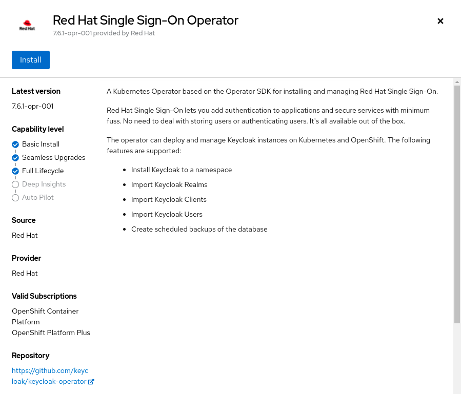


  2. Sign into Keycloak with admin credentials

  3. Setup a Realm for ACM under which all the configurations for the fleet of clusters will reside. Typically each realm is for an isolated set of Users, Groups, Clients and IdentityProviders associated with them. 
   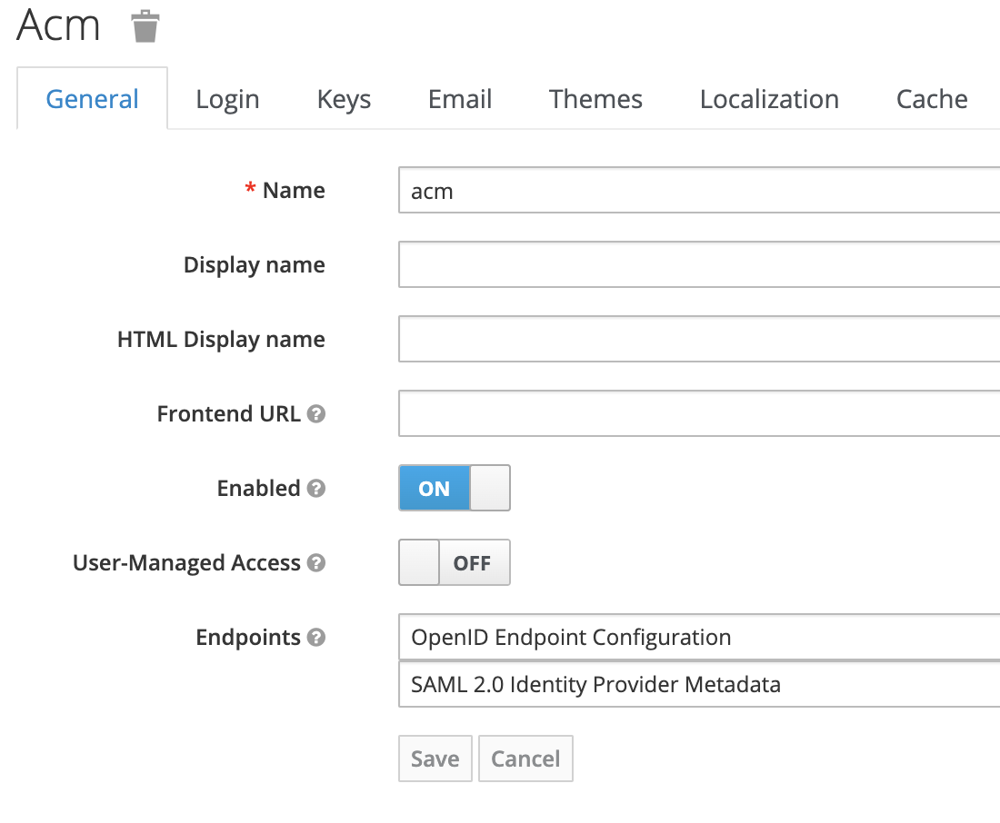

  4. Configure the Identity Provider in Keycloak. Keycloak will redirect users immediately to `auth.redhat.com` which acts as the Authorization OIDC server.
     OIDC stands for "OpenID Connect". It is an authentication protocol which allows to verify user identity when a user is trying to access a protected HTTPs end point. 

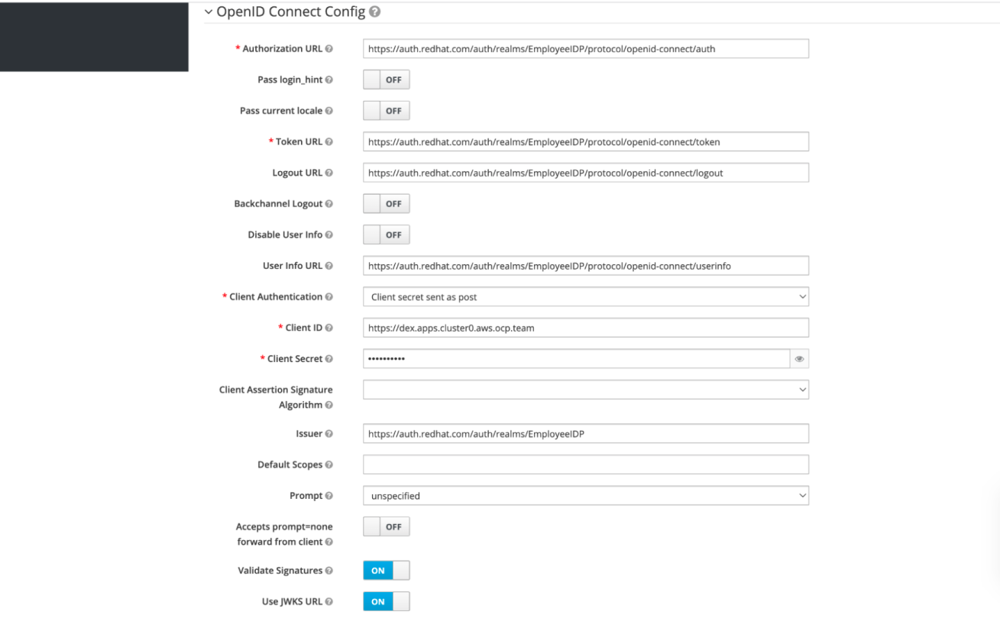


  5. The Authentication Flow configured is Basic browser based flow with redirect to the configured IDP to authenticate incase cookies are deleted or timeout happened

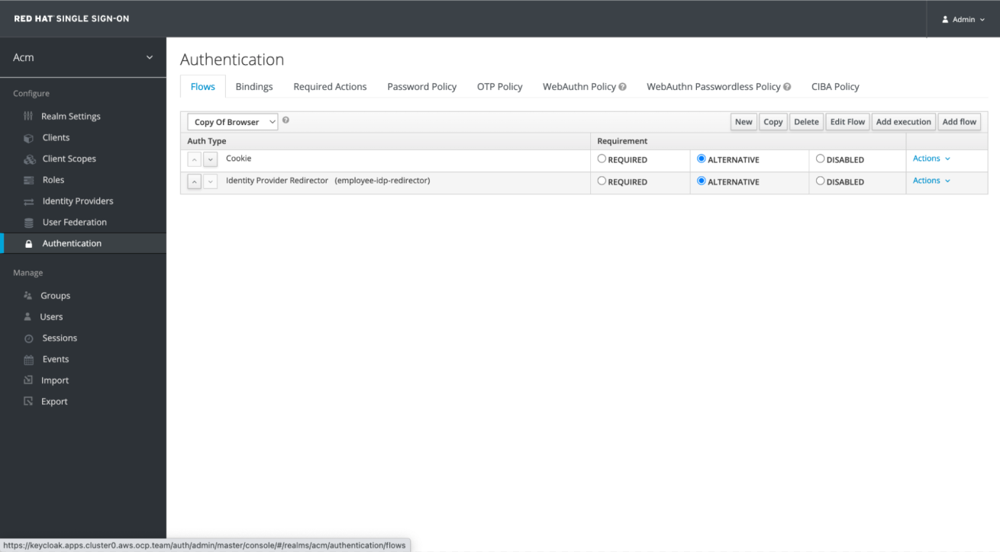
  

### Configure SSO for ACS 


With RHACS you can have multiple auth providers including OpenShift. You can consume the OpenShift one and use what you already have or use another openid as you like for example you can configure OCP to use keycloak and configure ACS to use OCP oauth.
In the following we will proceed and use the option to configure ACS to consume Keycloak as auth provider which will get us the same result!


  6. Clients: Client config is probably the most important aspect of this workflow. There is a client created for each Spoke/Managed cluster and one associated with each Service such as ACS 

  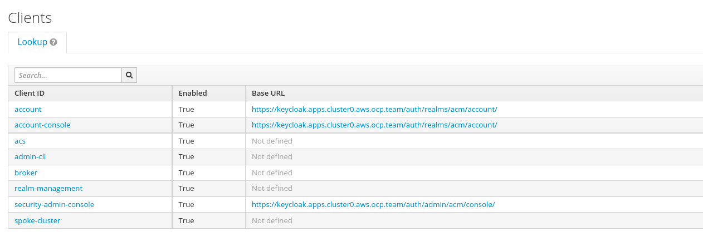  

Example ACS Client

  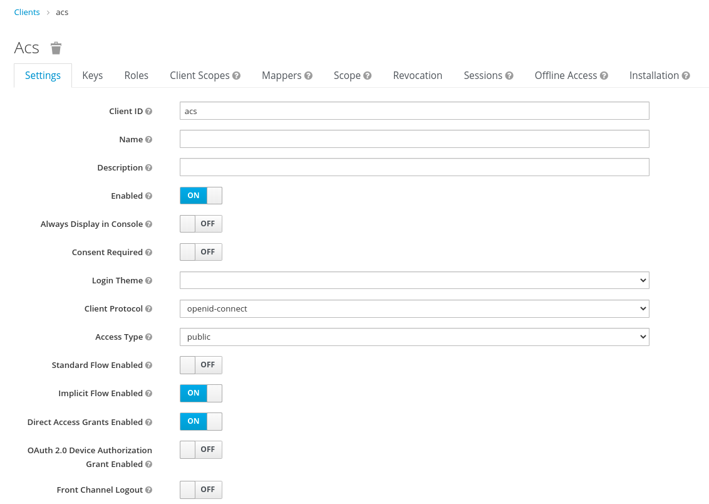 

Some important settings are as follows:
a: Redirect URL after user successfully logs in with the Authorization server in previous step 
For OpenShift: https://oauth-openshift.apps.cluster-live.aws.ocp.team/oauth2callback/keycloak

For ACS clients there are 2 redirect urls:
https://central-stackrox-central.apps.cluster0.aws.ocp.team/auth/response/oidc
https://central-stackrox-central.apps.cluster0.aws.ocp.team/sso/providers/oidc/callback

Note: In the ACS Console you will need to add Keycloak as the IDP

- Pre-req: ACS Central is installed on the Hub cluster and Admin has link to the console with credentials. 
- Goto the ACS Console -> Platform Configuration -> Access Control -> Create Auth Provider -> Select OIDC in the drop down
- Copy the Callback URLs from this menu and add them to the Keycloak console while Creating the ACS Client. 
  Once the ACS Client is created in Keycloak you will need to add Client id and client secret in ACS Console. 


 
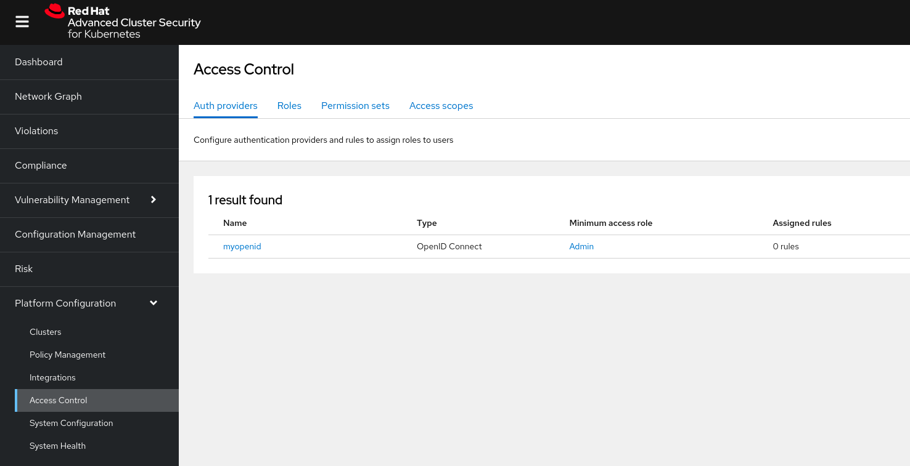 


ClientID and Secret

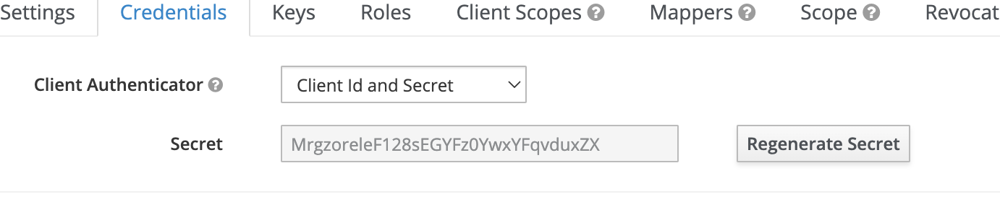 


Client scopes  OpenShift client


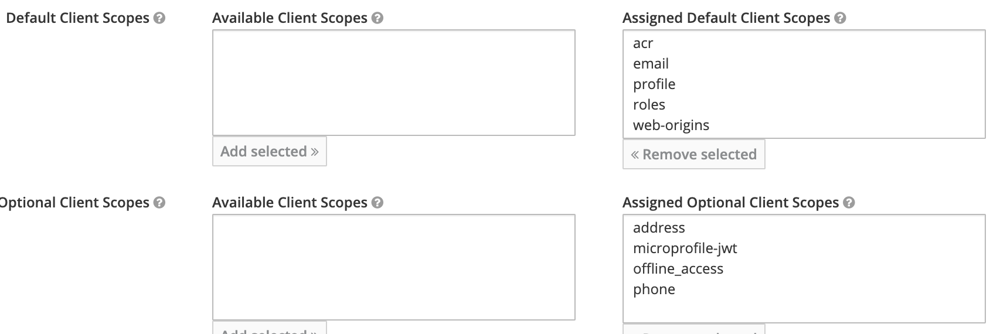   
 

Client scopes  ACS client


7: Client Roles and Mappers OCP
Keycloak gives the option to define Roles that can be applied to users. 


Mapping IDP group into ACS role
            We wanted to map the same group (in our case openshift-pm) coming from RHSSO into 

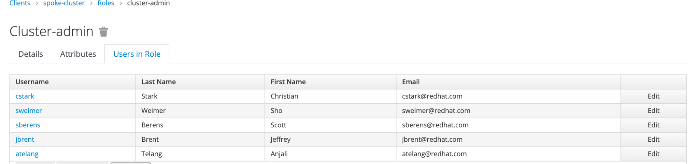

These roles can then be synced to Groups on the OpenShift clusters and admin can then create role binding to map the group to roles inside the openshift cluster, in this case cluster admin roles for the group of users above. 


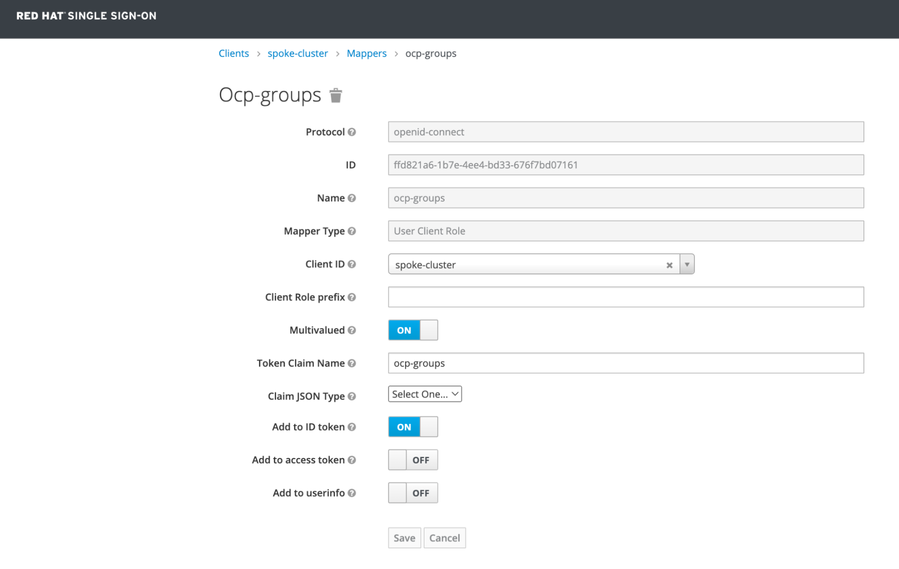

8: Mapping IDP group into ACS role
            We wanted to map the same group (in our case openshift-pm) coming from RHSSO into ACS. 
Prerequisite from ACS: To map IDP groups into ACS groups and roles we need ACS needs ‘groups’ claim in the ID token it receives from Keycloak. 
Goto the Keycloak Instance and follow these Steps:

8.1 Under the acs client you have created in Step 6, Goto Mappers and create a mapper. Make sure to add Token Claim Name as ‘groups’


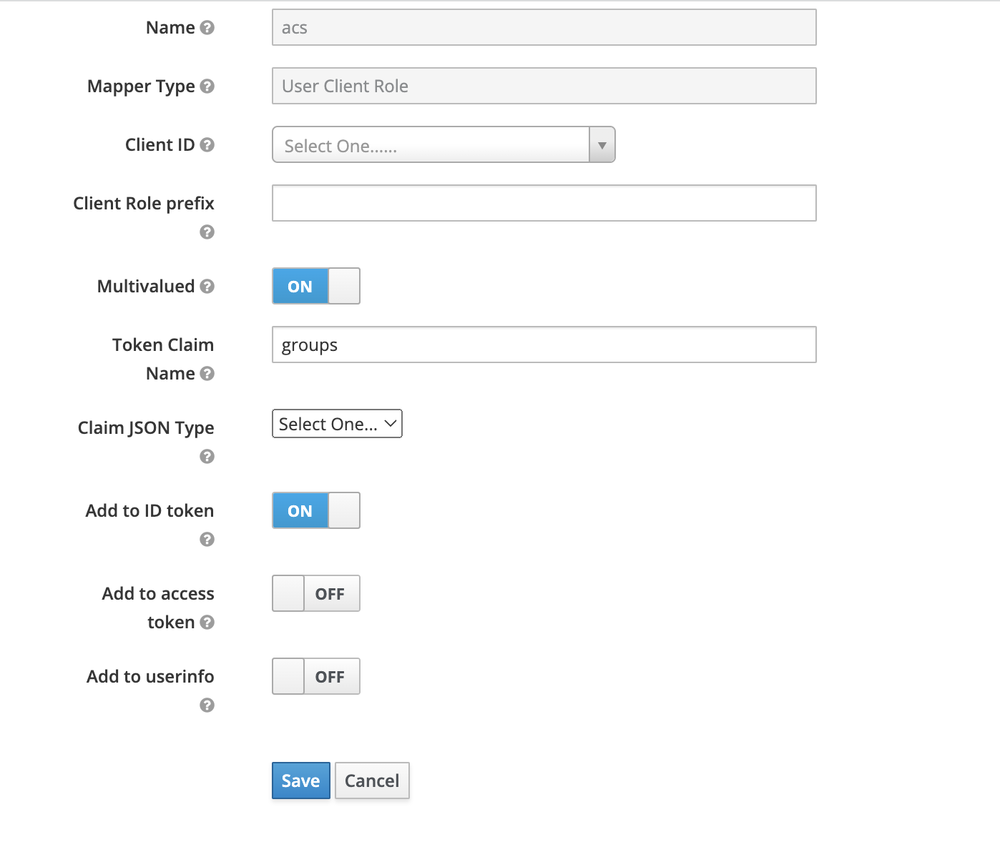


8.2 Create a new Realm role. In our case we will name it acs_admin. We want to map the groups coming in from the Keycloak IDP to this role that will be reflected in the ID token. 

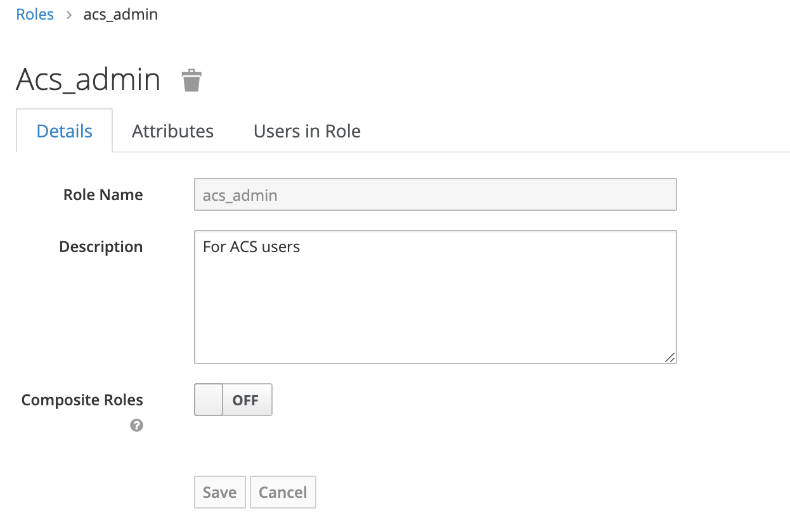  

8.3 Now the actual mapper step. Let’s create a mapper in the Keycloak UI under
     Identity provider -> mappers  and map the roles coming in from IDP to acs_admin


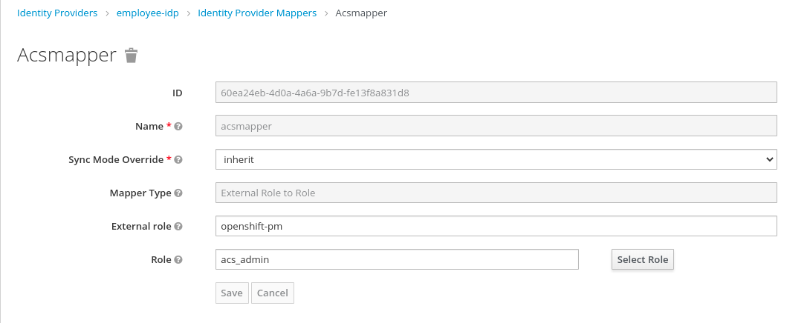


8.4 Using Client Scopes: This is an important option. We can either add mappers and scopes under individual clients or use this approach which is to create a separate scope that can be applied to multiple clients that want to use the same scope. Here’s how to do it. 
In the Keycloak Instance, goto Client Scopes -> New client scope. Add a name, in our case we added “acs” to match the scope to any acs clients.

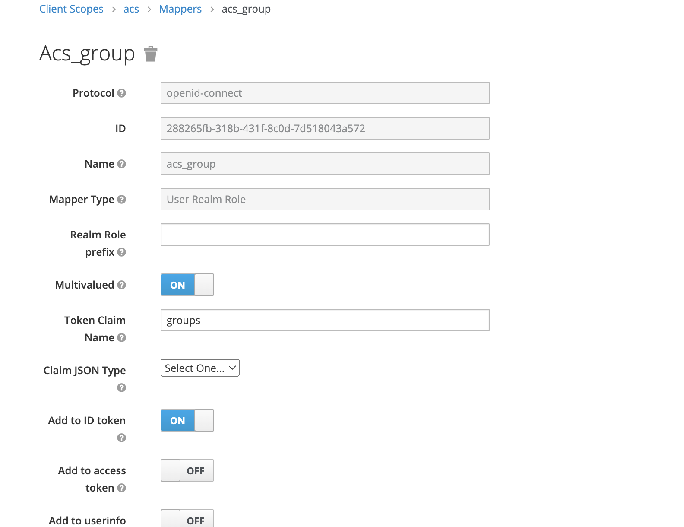


Next, we add mapper to it, by going to Client Scope -> Mapper tab and select Create new with  Protocol Mapper type as “User Realm Role” and Token Claim Name as “groups” and make sure to have Include in ID Token as ON. 


Next we want to include the scope to only have the Realm role acs_admin which we created in 8.3 above
 
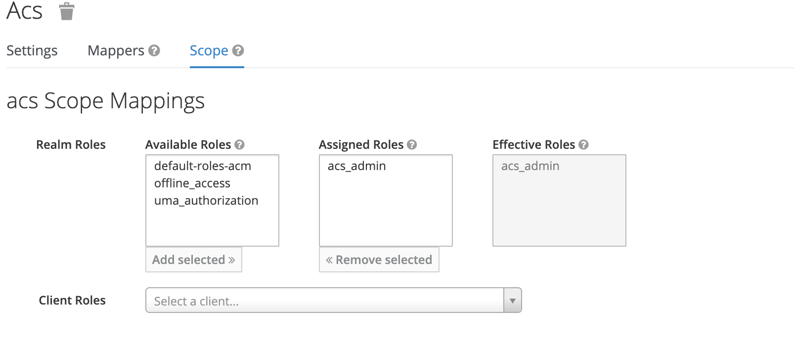


8.5 Now that we have this scope, we want to make sure that it is applied client. So goto the Keycloak console -> Clients -> select the ACS client you created -> Client Scopes and select the client scope you created in Step 8.6 from the Available Client Scopes and add it to Assigned Default Client scopes. 

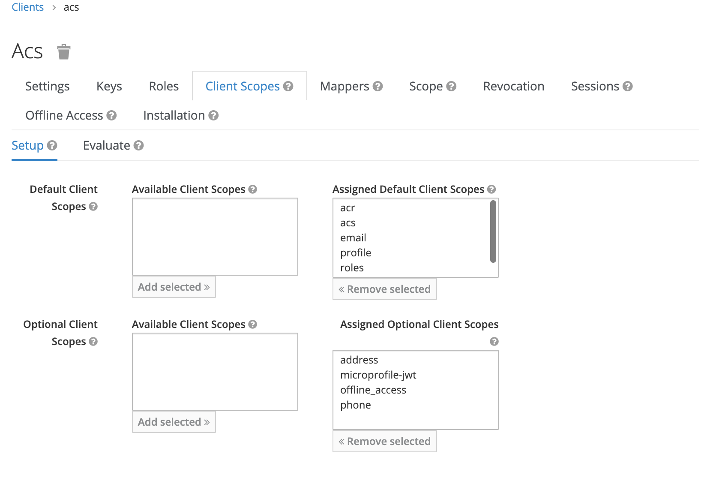


8.6 Check your Identity Provider settings in the Keycloak console and make sure “Sync Mode” is set to “Force” so that any changes in the IDP are reflected in the User’s login. This is important from a compliance standpoint because if any employee quits, they don't get access as the user’s info is updated immediately. 

That’s it. Test by logging into your ACS Console and making sure you can see you are logged in with SSO and have the necessary Role reflected there. 


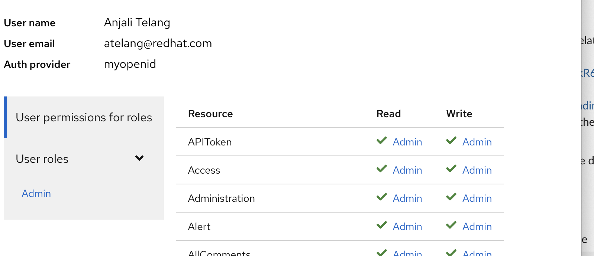


Go, back to the KeyCloak console and check again for the User menu -> Find the User -> (In this case me atelang) -> Select the User ID -> Goto ‘Role Mappings’ tab -> Look for “Assigned Roles” This should show you the assigned role of “acs_admin” 

Also goto Clients -> “acs” client which we created earlier -> Client Scopes -> Evaluate to see the ID Token information. ID token should show you the claim for groups with role “acs_admin” 


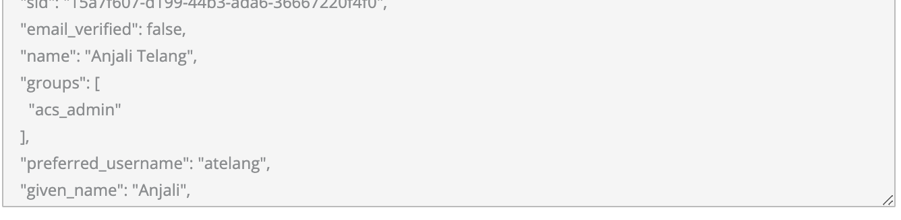


Last: 
spoke/managed clusters 
Spoke/Managed clusters have OAuth servers configured to use OIDC with Issuer url pointing to the Keycloak instance on the Hub cluster
Role Bindings need to be created to map the groups to cluster roles.  


Helper Commands

```
# get spoke cluster's redirect url
echo "$(oc get -n openshift-authentication cm v4-0-config-system-metadata -o jsonpath='{.data.oauthMetadata}' | jq -r '.issuer')/oauth2callback/keycloak"

# get route's ca
oc -n openshift-ingress-operator get secret router-ca -o jsonpath="{ .data.tls\.crt }" | base64 -d -i > ca.crt
oc -n openshift-config create cm keycloak-ca --from-file=ca.crt

# create client secret
oc -n openshift-config create secret generic keycloak-idp-secret --from-literal=clientSecret=<secret>

# check current idps status
oc describe oauth cluster

# create keycloak idp
oc apply -f ocp-idp.yaml

# create binding between cluster-admin group and role
oc apply -f cluster-admin-from-group.yaml

# remove default binding for unauthorized users
oc describe clusterrolebindings basic-users
oc patch clusterrolebindings basic-users --type json -p='[{"op": "remove", "path": "/subjects/0"}]'

```

```
apiVersion: rbac.authorization.k8s.io/v1
kind: ClusterRoleBinding
metadata:
  name: cluster-admin-from-group
roleRef:
  apiGroup: rbac.authorization.k8s.io
  kind: ClusterRole
  name: cluster-admin
subjects:
- apiGroup: rbac.authorization.k8s.io
  kind: Group
  name: cluster-admin
```


Configure OAuth on the Spoke/ManagedCluster

```
apiVersion: config.openshift.io/v1
kind: OAuth
metadata:
  name: cluster
spec:
  identityProviders:
  - name: keycloak
    mappingMethod: claim
    type: OpenID
    openID:
      clientID: spoke-cluster
      clientSecret:
        name: keycloak-idp-secret
      ca: 
        name: keycloak-ca
      claims:
        preferredUsername: 
        - preferred_username
        name: 
        - given_name
        - name
        email: 
        - email
        groups: 
        - ocp-groups
      issuer: https://keycloak.apps.cluster0.aws.ocp.team/auth/realms/acm # needs to match current KC address
```


### Possible Extension of the solution

From ACM-Point of view we can create a SSO-PolicySet

on the hub configure Keycloak
on the spoke setup OAuth and all the necessary secrets and configmaps


Special thanks goes to


